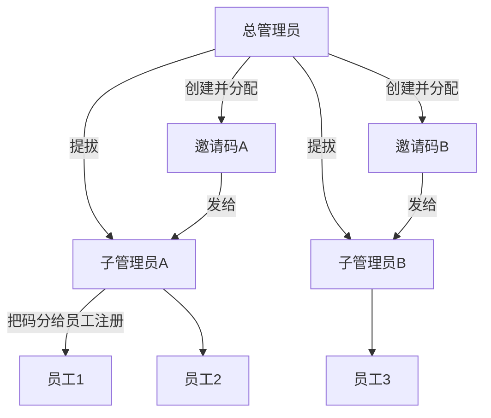

# 邀请码层级管理方案

## 对你思路的理解（先对齐）

你要的不是「子管各管一块 CMS 页面」，而是**用人脉/组织关系管人**：

- **总管**：创建邀请码 → 分给子管；在用户名单里搜人 → 提拔为子管；能看/管全部人。
- **子管**：领到自己的邀请码后发给员工；**只能看到、管理用自己名下邀请码注册的员工**。
- **员工**：用子管给的邀请码注册，角色仍是参与者。

这和同学说的「名单里搜姓名 → 点一下赋权」可以合在一起：**赋权 = 提拔为子管 +（同时）把某张邀请码挂到他名下**。

---

## 和现状的差距（已有基础）

已有能力（可复用）：

- 邀请码表 [`backend/app/models/admin_extra.py`](backend/app/models/admin_extra.py)：`code / max_uses / used_count / enabled / created_by`
- 注册可选填邀请码、扣次数：[`backend/app/api/auth.py`](backend/app/api/auth.py)
- 总管侧邀请码 CRUD UI：[`frontend/src/pages/AdminAccountsPage.tsx`](frontend/src/pages/AdminAccountsPage.tsx)
- 用户名单搜索：[`backend/app/api/admin.py`](backend/app/api/admin.py) `GET /users?q=`

缺的关键环节：

1. 用户注册时**没有把「用了哪张邀请码」写进用户表**（只写在事件文案里），事后无法可靠圈定「某子管名下员工」。
2. 邀请码没有「归属子管」字段（只有 `created_by`，不够表达「分发给谁」）。
3. 角色只有 `participant` / `admin`，且 [`seed_admin_if_needed`](backend/app/services/seed.py) 会**强制只留一个 admin**，会直接毁掉多子管。
4. 管理接口一律 `get_current_admin`，没有「按归属过滤名单」。

---

## 推荐数据模型（第一版）

**角色（三档）**

| role | 含义 |
|------|------|
| `super_admin` | 总管（现有 seed 账号升级为此角色） |
| `sub_admin` | 子管 |
| `participant` | 员工/参与者 |

**用户表增量**（[`User`](backend/app/models/user.py)）

- `invited_by_code_id`：注册时用的邀请码 id（可空；无码注册的人只归总管看）
- 现有 `role` 扩成上面三档

**邀请码表增量**（[`InviteCode`](backend/app/models/admin_extra.py)）

- `owner_id`：这张码「分给了哪个子管」（可空=尚未分配，只有总管能再分配）
- 保留 `created_by` = 谁创建的（通常是总管）

归属规则（写死进方案，避免事后扯皮）：

- 员工归属子管 = 该员工 `invited_by_code_id` 对应邀请码的 `owner_id`
- 一张码只挂一个子管；一个子管可以有多张码
- 无邀请码注册的用户：`invited_by_code_id = null`，**仅总管可见可管**

---

## 权限与操作边界

**只有总管可以：**

- 提拔 / 降级子管（用户名单：搜昵称/邮箱 → 点用户 →「设为子管理员」或「取消子管」）
- 创建邀请码、把邀请码 `owner_id` 指给某个子管、停用任意码
- 查看全部用户、全部邀请码

**子管可以：**

- 查看**自己名下**邀请码（只读码面、用量；第一版不让子管自己新建码，避免绕过总管配额）
- 把码发给员工（线下/微信即可；系统侧就是「员工注册时填这个码」）
- 用户名单里只看到：用自己名下码注册的员工
- 对这些员工做现有能力：看得分/人格、启用禁用、重置密码（范围过滤后的同一套接口）

**子管不可以：**

- 提拔别人、改别人权限（你已选 A）
- 看到别的子管名下员工
- 第一版也不给：内容管理 / 页面管理 / 全局注册策略等「全站配置」（避免又回到分区 CMS；若以后要再加）

---

## 主流程（产品侧）

1. 总管登录 → 用户名单搜到同学 → 「设为子管理员」
2. 总管在「注册与登录 / 邀请码」创建码（可设次数上限）→ 「分配给：子管某某」
3. 子管登录 → 看到自己的码 → 把码发给员工
4. 员工注册填写该码 → 自动挂到该子管名下
5. 子管打开用户名单 → 只能管这些人

---

## 后端改造要点

- 改 seed：只保证**一个** `super_admin`，**不再**把其它 admin 一律降级为 participant；把现有 `admin` 迁移为 `super_admin`
- `get_current_admin` → 拆成：`require_staff`（总管或子管）与 `require_super_admin`
- 注册成功后写入 `user.invited_by_code_id`
- `GET /admin/users`：总管看全部；子管按「自己 owner 的码」过滤；支持按昵称搜索（同学要的交互）
- 新增：`POST /admin/users/{id}/role`（仅总管）body: `sub_admin` | `participant`
- 邀请码：创建/分配/停用仅总管；列表接口按角色过滤；增加 `owner_id` / 分配接口
- 所有改用户状态/重置密码的接口：子管只能操作自己名下员工

## 前端改造要点

- 用户数据页：总管增加「设为/取消子管理员」；子管隐藏该按钮
- 邀请码页：总管增加「分配给子管」下拉；子管只读自己的码列表（方便复制发给员工）
- 登录后导航：子管只进「用户数据 + 我的邀请码 + 我的账号」（不做全套管理台）
- Auth / `UserOut` 带上 `role`，前端按角色切 UI

## 历史数据

- 已注册但事件里只有文案、没有 `invited_by_code_id` 的用户：第一版视为「无归属，仅总管可见」；不强行猜归属
- 已有邀请码：`owner_id` 为空，总管重新点一次「分配」即可

---

## 明确不做（避免范围膨胀）

- 不做完整 RBAC / 按 CMS 模块勾选权限
- 第一版不让子管再创建下级邀请码（二级分发只靠「总管发码 → 子管转发同一张码」）
- 不改同学刚合并的「预览用户界面」逻辑（可并存）

---

## 风险与注意

- 若开放「无邀请码也能注册」，会出现大量「无主」用户，只能总管管；若实验场景希望人人进组织，可后续把注册改成**强制邀请码**
- Neon 上要加列（`role` 取值扩展 + 两个外键字段），部署后需重启服务跑建表/迁移策略（与现有项目一致：SQLAlchemy `create_all` 或补迁移脚本）
